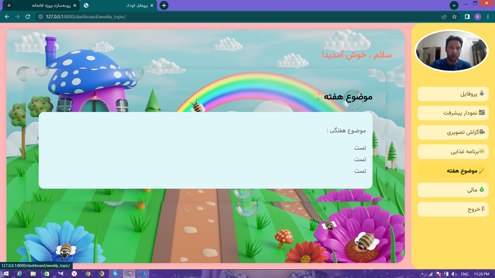

# Kindergarten Management System

This project is a Kindergarten Management System developed with Django.  
It manages five different classes named: Laleh, Yas, Rose, Zanbagh, and Narges.  

The system allows uploading child profiles, photos, and required videos, tracking progress in various activities, and recording financial reports, all managed by the admin.  
Users can log in with username and password to access their dashboard, where a sidebar with submenus provides access to related information.  
Notably, in the visual report section, each user can only see the photos and videos related to their own class and cannot access other classes' media.

---

## Features

- Responsive Home Page  
- Secure Login Form  
- Child Dashboard with detailed profile and progress charts  
- Food program management  
- Financial reports section  
- Video and image gallery limited to user’s class  
- Admin panel for managing all aspects  

---

## Screenshots

| Admin Panel           | Food Program       | Child Profile     |
|-----------------------|--------------------|-------------------|
|  |  |  |

| Progress Chart        | Financial Report   | Video Report      |
|-----------------------|--------------------|-------------------|
|  |  |  |

| Login Page            | Weekly Topic       |
|-----------------------|--------------------|
|  |  |

---

## Installation & Running

1. Clone the repository:

```bash
git clone https://github.com/USERNAME/kindergarten-django.git
cd kindergarten-django
```

2. Install dependencies:

```bash
pip install -r requirements.txt
```

3. Apply database migrations:

```bash
python manage.py migrate
```

4. Run the development server:

```bash
python manage.py runserver
```

---

## Project Structure

- `kindergarten_project/` — Django project settings  
- `apps/` — Different Django apps such as registration, dashboard, etc.  
- `templates/` — HTML templates  
- `static/` — CSS, JavaScript, and static files  
- `media/` — Uploaded media files (images, videos)  

---

## Contact

For any questions or collaboration, feel free to contact me on WhatsApp:  
**+90 545 355 2303**

---

## License

This project is licensed under the MIT License.